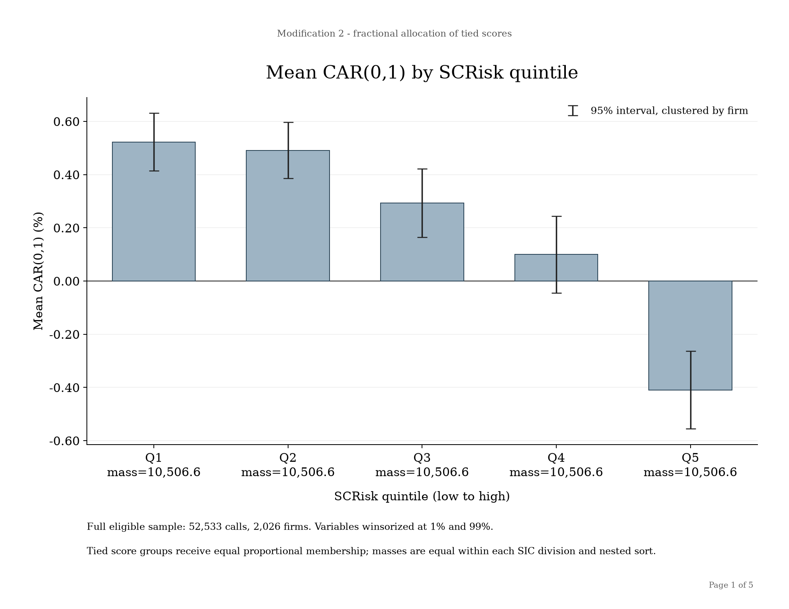
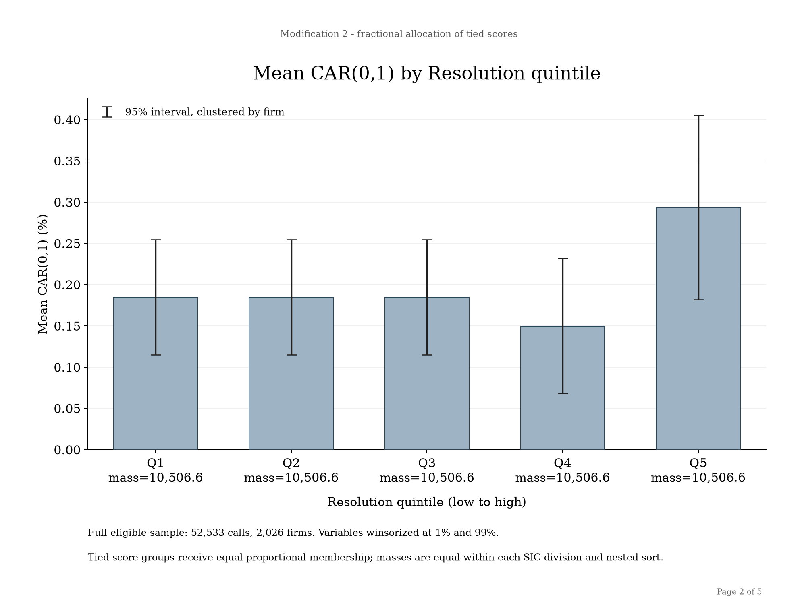
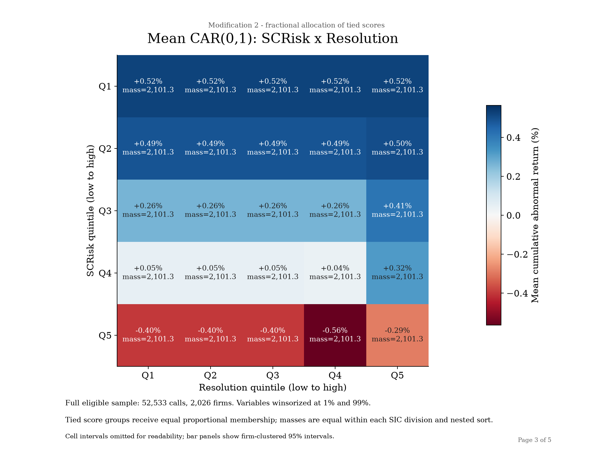
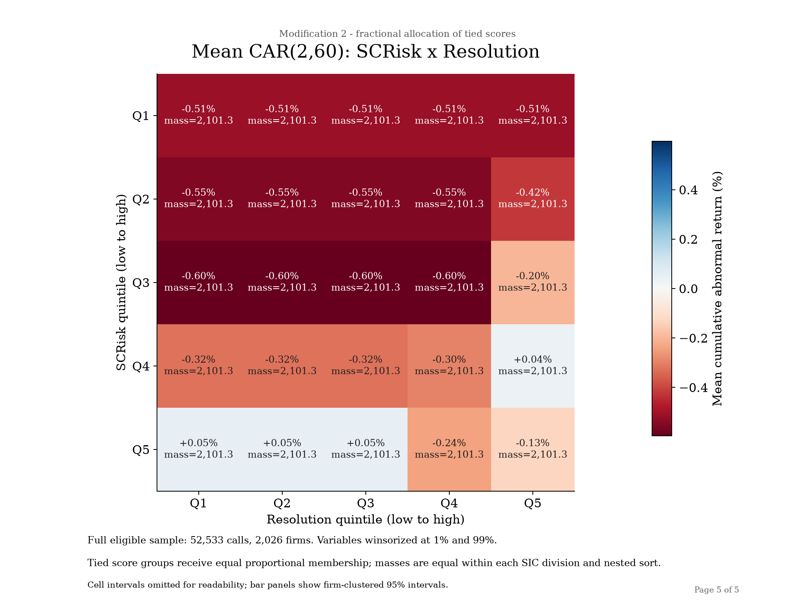

# Supply-chain language and stock-market reactions

This project asks whether the language managers use to describe supply-chain
risk and its resolution is associated with abnormal stock returns around
earnings announcements. It reconstructs the text measures and portfolio design
in Theile et al. (2026) for a deliberately bounded 2010-2019 sample. The goal is
not to produce an exact replication, but rather to rebuild the pre-liminary monotonic pattern using similar methodology and test our own hypotheses around industry specific questions.


The main descriptive result is a negative short-window association. Mean
Carhart CAR(0,1) declines from **0.52%** in the lowest fractional SCRisk
portfolio to **-0.41%** in the highest. This gradient is economically
interesting, but it is not a causal estimate and it is sensitive to how the
large mass of zero scores is represented.

## Research question and motivation

Supply-chain disruptions are difficult to observe consistently across firms.
Earnings calls offer a common disclosure setting in which managers discuss
shortages, suppliers, logistics, and remediation in their own words. That makes
the calls useful for studying two related questions:

1. Are calls with more supply-chain-risk language followed by different market
   reactions?
2. Conditional on measured risk, is language about resolution associated with
   a different reaction?

The design combines transparent dictionary-based NLP with a conventional
Carhart event study. It is intended to make the measurement choices visible,
especially the treatment of zero and tied scores that dominate the lower
portfolios.

## Data and event-date policy

The immutable v1 corpus contains **58,305 calls from 2,200 companies**, covering
`2010Q1` through `2019Q4`. All calls are scored and remain represented in the
derived call-level dataset. Sequential market-data and SIC gates produce a
common portfolio sample of **52,533 calls from 2,026 firms** across nine SIC
divisions.

| Sequential market-data sample | Calls available for analysis |
| --- | ---: |
| 1. Source transcripts | 58,305 |
| 2. Calls with valid transcript scores | 58,305 |
| 3. Calls using earnings-release dates under the study policy | 58,305 |
| 4. Calls matched to a price identity | 58,106 |
| 5. Calls with adjusted-price coverage | 57,682 |
| 6. Calls with both CAR windows | 56,216 |
| Final portfolio-analysis sample with historical SIC division | 52,533 |

The event date is the reported **earnings-release date** stored in v1's
`earnings_call_date` field. Day 0 is the first trading day on or after the selected release date;
there is no after-hours shift.

The frozen transcript source is
`data/final/earnings_call_transcripts_validated_2010_2019_v1.csv` (SHA-256
`06d4620290b4b8a66f18a8762d5042968d4b436d4aef7009f6004d9d331eece3`).
Producing a corrected corpus requires a new version; v1 is never edited in
place.

## Reconstructed dictionaries and text measurement

The study uses only the versioned canonical libraries below. They reconstruct
unpublished author inputs and should not be described as recovered originals.

| Component | Terms | Canonical file | SHA-256 |
| --- | ---: | --- | --- |
| Supply-chain vocabulary | 254 | `dictionaries/theile_reconstruction_v1/supply_chain/supply_chain_terms.jsonl` | `d53b93936e0228205fbbb183037acc71094d8c390ac77179f044f8404e14d1ea` |
| Risk vocabulary | 161 | `dictionaries/theile_reconstruction_v1/risk/risk_terms_reconstructed_full.txt` | `c5f9fecb77f52802047aa7094e3999e428c3a53f8c936424d7ab50b9884136b8` |
| Conservative Resolution vocabulary | 55 | `dictionaries/theile_reconstruction_v1/resolution/resolution_terms_conservative_baseline.txt` | `070b8cdc168a0db96db7f68fef5b0f3e08bde10ec5d7b4161ed882453a57d464` |

The approved tokenizer and longest-first multiword matcher are applied without
adding seeds, stemming, inferred inflections, or alternate dictionaries. For
each transcript, every supply-chain/risk occurrence pair at closest-token
distance at most 10 contributes the supply-chain term's `max_cosine` weight.
Resolution is a subset of those risk pairs: it contributes when a Resolution
term is also within 10 tokens of the supply-chain span. Overlapping and
identical-span matches are retained and audited.

The weighted sums are divided by tokenized transcript length. Each resulting
raw score is then divided by its population standard deviation across all valid
v1 calls, without mean centering. The call-level output retains the raw match
counts, weighted sums, length-adjusted scores, standardized **SCRisk** and
**Resolution**, zero indicators, dictionary paths and hashes, and the complete
match audit.

## Carhart abnormal returns

Daily returns use split- and dividend-adjusted closes. Expected excess returns
come from an OLS Carhart model with an intercept, Fama-French Mkt-RF, SMB, and
HML, plus momentum. Factors are converted from percent to decimal before
estimation.

Each model uses exactly **200 trading observations**, from event time -209
through -10. Missing observations do not shorten the window. Abnormal returns
are summed over two non-overlapping horizons:

- **CAR(0,1):** event day 0 and day 1, two trading days.
- **CAR(2,60):** trading days 2 through 60, 59 trading days.

The output preserves ticker mappings, adjusted-price provenance, model
coefficients, rank, condition number, residual RMSE, R-squared, event-day
mapping, missing dates, and every exclusion reason.

## Fractional portfolio construction

SCRisk, Resolution, CAR(0,1), and CAR(2,60) are winsorized at the linear 1st and
99th percentiles of the 52,533-call analysis sample; the original values remain
available. SCRisk portfolios are formed within SIC division and then pooled
across divisions. Resolution portfolios are formed within SIC division and
SCRisk portfolio.

All observations are retained, including **21,027 zero-SCRisk calls** and
**46,123 zero-Resolution calls**. When a tied score group crosses a quintile
boundary, every call in that group receives the same proportional membership
in each portfolio it spans. For example, a zero-score group that supplies 60%
of Q1 and 40% of Q2 gives every zero-score call weights of 0.6 and 0.4 rather
than assigning observationally identical calls by an arbitrary ordering. Each
call's weights sum to one. Within every SIC division, each SCRisk portfolio has
one-fifth of the division's effective mass; the nested Resolution cells each
have one twenty-fifth. After pooling, each SCRisk portfolio has effective mass
**10,506.6**, and every SCRisk x Resolution cell has effective mass **2,101.32**.

Means use fractional membership weights. The reported 95% intervals use
one-way CIK-clustered weighted score sums and a t critical value. They account
for repeated calls by a firm, but not common-date cross-firm dependence or
uncertainty from reconstructing the dictionaries. No controlled regressions
are included.

## Findings

### SCRisk and the announcement-window return



*Figure 1. Fractional-allocation portfolio means; bars show 95% intervals
clustered by firm.*

| Fractional SCRisk portfolio | Mean CAR(0,1) | Firm-clustered 95% interval | Effective mass |
| --- | ---: | ---: | ---: |
| Q1, lowest | 0.52% | [0.41%, 0.63%] | 10,506.6 |
| Q2 | 0.49% | [0.39%, 0.60%] | 10,506.6 |
| Q3 | 0.29% | [0.16%, 0.42%] | 10,506.6 |
| Q4 | 0.10% | [-0.04%, 0.24%] | 10,506.6 |
| Q5, highest | -0.41% | [-0.56%, -0.26%] | 10,506.6 |

The mean CAR returns in the short, 2 trading day window decline as measured SCRisk rises. The lowest three
portfolio means are positive, Q4's return is small and its 95% interval includes zero, and Q5
is negative. Q1 is entirely composed of fractional
weight from zero-SCRisk calls, while zero calls also contribute heavily to Q2
and modestly to Q3.


### Resolution and the announcement-window return



*Figure 2. Fractional-allocation Resolution portfolio means; bars show 95%
intervals clustered by firm.*

Zero Resolution scores dominate the
sample; Q1-Q3 have the same fractional composition and the same mean CAR(0,1),
0.18% with a 95% interval of [0.12%, 0.25%]. Q4 averages 0.15% [0.07%, 0.23%]
and Q5 averages 0.29% [0.18%, 0.41%]. These estimates might indicate that the relationship between the resolution scores and the mean returns might be non-linear, in that the score needs to cross a certain threshold to produce a meaningful difference in average return.



*Figure 3. Mean CAR(0,1) for the nested SCRisk x Resolution portfolios.*

In portfolios Q2 to Q4, the highest Resolution cell has a higher mean return than the lowest (e.g., 0.41% vs 0.26% in Q3). This fits the idea that including resolution keywords might soften the market's response to disclosed risk, but the cells are noisy and one cell breaks the pattern. More evidence is needed to validate this hypothesis.



*Figure 5. Mean CAR(2,60) for the nested SCRisk x Resolution portfolios.*


Over days 2–60, the ordering partly reverses: the highest-risk portfolio averages −0.04% against roughly −0.5% for the lowest three. If this holds up, the market's initial response to supply-chain risk language may overshoot.
### Fractional figures and supporting tables

The complete five-page result is available as the
[fractional-allocation portfolio PDF](docs/fractional_results/portfolio_charts_fractional_ties.pdf).
The remaining standalone figure is:

- [Mean CAR(2,60) by SCRisk quintile](docs/fractional_results/04_car_2_60_by_scrisk.png)

Machine-readable supporting tables give `fractional_mass` (sum of membership
weights, also kept under the old name `effective_n`), `contributing_calls`
(distinct call IDs with positive weight), `membership_rows` (rows in the
expanded allocation, which exceed the call count when a call reaches a
portfolio through several SCRisk parents), `firms` (distinct CIKs), means,
standard errors, confidence intervals, zero weights, and SIC-division
coverage:

- [CAR(0,1) by SCRisk](docs/fractional_results/01_car_0_1_by_scrisk.csv)
- [CAR(0,1) by Resolution](docs/fractional_results/02_car_0_1_by_resolution.csv)
- [CAR(0,1) heatmap](docs/fractional_results/03_car_0_1_heatmap.csv)
- [CAR(2,60) by SCRisk](docs/fractional_results/04_car_2_60_by_scrisk.csv)
- [CAR(2,60) heatmap](docs/fractional_results/05_car_2_60_heatmap.csv)

These are the corrected tables produced by the reproduction command. The
original run labelled membership rows as `contributing_calls`, so its pooled
Resolution table reported 77,997 for Q1-Q3, above the 52,533-call sample. The
corrected counts are 46,123 unique calls in Q1-Q3, 47,408 in Q4 and 39,220 in
Q5, with the old numbers preserved as `membership_rows`. Unique counts overlap
across portfolios and must not be summed. Every mean, standard error and
interval is unchanged and verified against the frozen originals, which stay
byte-for-byte in
[`reproduction/fractional_v1/historical/`](reproduction/fractional_v1/historical/).

The [fractional-results manifest](reproduction/fractional_v1/historical/chart_manifest.json)
records the source and PDF hashes, winsorization thresholds, effective masses,
and zero-score allocations by SIC division.

## Limitations

- The dictionaries reconstruct unpublished author libraries; measurement error
  and alternative vocabulary choices are not reflected in the intervals.
- The approved implementation counts closest-token distances at most 10 and
  retains identical-span overlaps; the paper displays a strict less-than-10
  indicator. This predefined difference is not changed for the reported run.
- Reported earnings-release dates are used as event dates. They can differ from
  the actual conference-call date, and the design makes no after-hours shift.
- Historical adjusted-price and point-in-time SIC coverage are incomplete.
  Provider ticker histories are not CRSP permanent security identifiers.
- Fractional allocation removes arbitrary ordering within ties, but it does not
  create information where scores are identical. Heavy zero masses make some
  adjacent portfolios compositionally indistinguishable.
- The figures report winsorized portfolio means with firm-clustered uncertainty.
  They do not control for firm characteristics, time effects, or common shocks,
  and they should be interpreted as associations rather than causal effects.

## Planned extension: international hardware supply chains

The next extension will focus on hardware companies whose production depends
on international suppliers, contract manufacturers, logistics networks, and
geographically concentrated components. This setting provides a sharper test
bed for the text measures because exposure is economically concrete and often
cross-border. The extension will retain the same audit discipline while adding
explicit measures of supplier geography and international production exposure;
it will be versioned separately rather than altering the frozen 2010-2019
analysis.

## Directory guide

| Directory | Contents |
| --- | --- |
| `collection/` | Universe construction, transcript collection/validation, event inputs, price retries and date joins. |
| `dictionaries/` | Canonical libraries, reconstruction code, source manifests and outcome-blind reviews; the early library builder is retained for methodological context. |
| `scoring/` | Shared tokenizer, exact dictionary matcher, score calculation and segment joins. |
| `analysis/` | Fractional reproduction/export/covariance; `primary_event_study/` prepares scores and CARs; `charts/` renders fractional results; `provisional_diagnostics/` retains measurement audits. |
| `tests/` | Scoring, CAR/date policy, dictionary, fractional allocation and provenance tests. |
| `scripts/` | The documented reproduction entry point. |
| `reproduction/fractional_v1/` | Compact analysis input, schema, hash inventory and frozen reference tables. |
| `docs/` | Research/reproduction guides and final fractional figures/tables; `references/` holds the ignored local paper. |
| `data/` | Frozen/private datasets and historical provisional exports; raw inputs remain local. |
| `provenance/` | Historical records plus the [relocation and deletion record](provenance/repository_layout_v1/README.md). Original recorded paths are preserved. |
| `outputs/` | Ignored generated runs. Canonical published results are in `docs/fractional_results/`. |

Ignored `artifacts/`, `.archive/`, `review/` and `.lavish/` retain raw responses,
source vintages, adjudication evidence and existing collection review work.
They are excluded from the portable reproduction route.

## Reproducibility

The call-level scored-CAR dataset has SHA-256
`af88e549cc8b275262eeb1e69af4d4aeb3b554b6197577dc91d5b63cdef7e2a6`.
The fractional PDF has SHA-256
`eccca323094764a6e9da01797cb55baf1457c0013c122a3b2772be15a97da7b0`.
Its construction is implemented in
[`analysis/charts/fractional.py`](analysis/charts/fractional.py)
and audited by
[`tests/test_fractional_charts.py`](tests/test_fractional_charts.py).

To regenerate all five fractional figures and tables, install **Python 3.14.7**
with `venv` and `pip`, then run this command from the repository root:

```sh
sh scripts/reproduce_fractional.sh
```

If `python3` is a different version, select the interpreter explicitly:

```sh
PYTHON=/path/to/python3.14 sh scripts/reproduce_fractional.sh
```

The input is the versioned, transcript-free
[`reproduction/fractional_v1/analysis.csv.gz`](reproduction/fractional_v1/analysis.csv.gz)
(5.6 MB). No private transcripts or provider credentials are needed for this
route. Package installation requires network access or a populated pip cache;
the analysis itself runs offline.

The script creates `.venv-fractional`, installs the pinned dependencies in
[`requirements-fractional.lock`](requirements-fractional.lock), tests scoring,
CAR calculations, fractional weight conservation, equal portfolio mass, nested
Resolution allocation and shared-observation covariance, then checks input/code
hashes and regenerated results against the frozen references.

Results are written to `outputs/fractional_reproduction_v1/`:

- Five PNG figures and the five-page `portfolio_charts_fractional_ties.pdf`.
- Five table CSVs containing the data behind the charts: mean returns,
  confidence intervals, fractional mass, and call/firm counts. They match
  the published tables in `docs/fractional_results/`.
- `portfolio_comparisons.csv` with 630 pairwise portfolio comparisons.
  These account for shared calls and firms when testing
  return differences; they are supporting statistics, not chart inputs.

The tables distinguish fractional mass, unique calls, firms and membership
rows, correcting the old pooled Resolution call count while preserving means
and intervals. Comparisons between overlapping portfolios use covariance-aware
uncertainty.

Existing output directories are never overwritten. For another run, choose a
new directory:

```sh
sh scripts/reproduce_fractional.sh outputs/fractional_reproduction_rerun
```

To regenerate only the outputs using the already installed environment:

```sh
.venv-fractional/bin/python -m analysis.fractional_reproduction --output outputs/fractional_figures_rerun
```

Rebuilding scores and CARs from raw inputs additionally requires the private
frozen transcripts, adjusted prices, factors and identity/date inputs listed in
[`reproduction/fractional_v1/raw_inputs.json`](reproduction/fractional_v1/raw_inputs.json).
After setting up the environment above, check their paths and hashes with:

```sh
.venv-fractional/bin/python -m analysis.check_fractional_raw_inputs \
  --input-root /path/to/private/input/root \
  --report outputs/raw-input-check.json
```

The input root must preserve the relative paths in the inventory. Follow the
raw-input commands in the guide below only after this check passes. A public
checkout supports the analysis-dataset route; it does not contain the private
inputs required for a full raw rebuild.

See [the reproduction guide](docs/FRACTIONAL_REPRODUCTION.md) for exact inputs,
code provenance, raw-input commands and uncertainty definitions, and
[the validation record](docs/FRACTIONAL_VALIDATION.md) for clean-checkout evidence
and limits. Frozen transcript inputs and large raw files remain outside Git.
