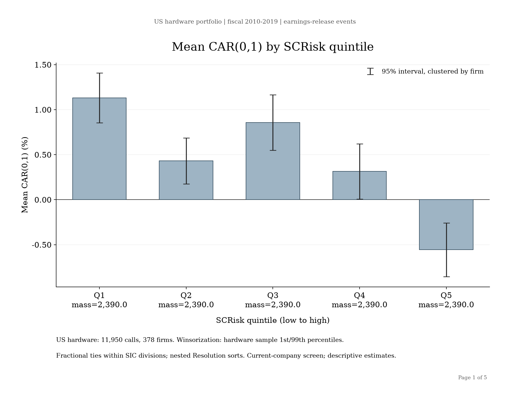
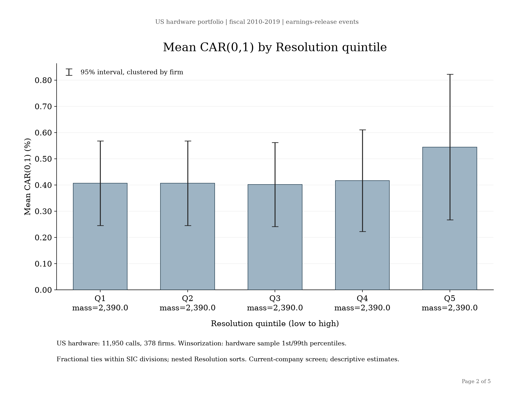
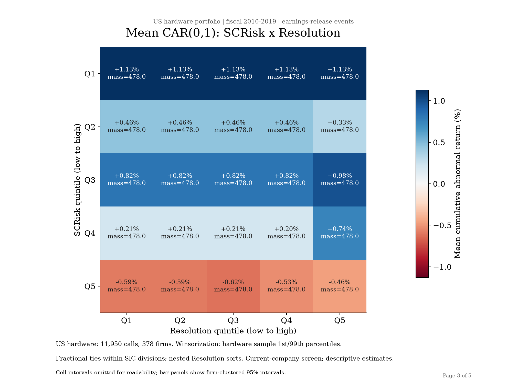
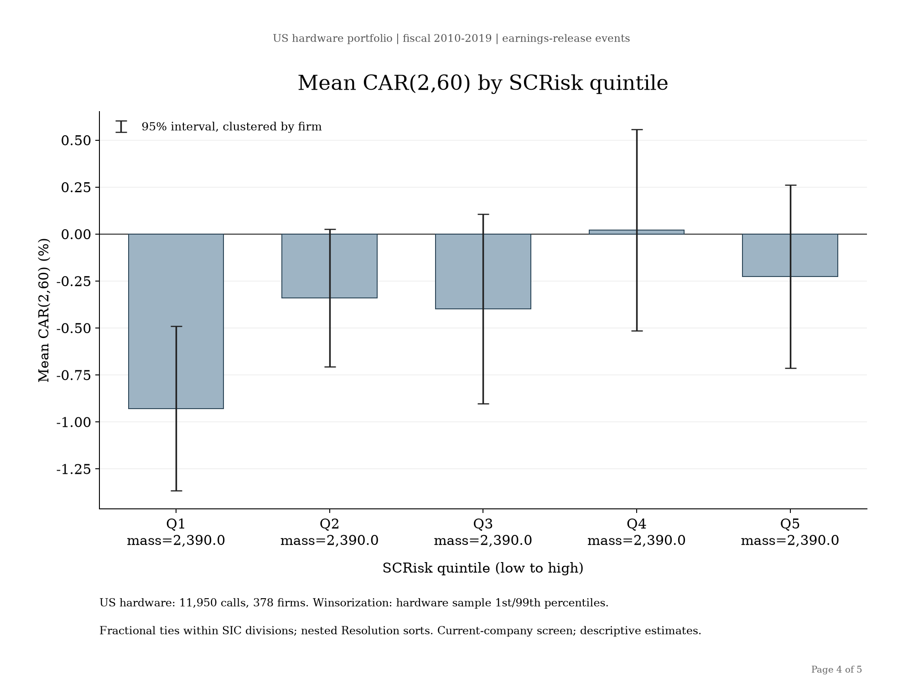
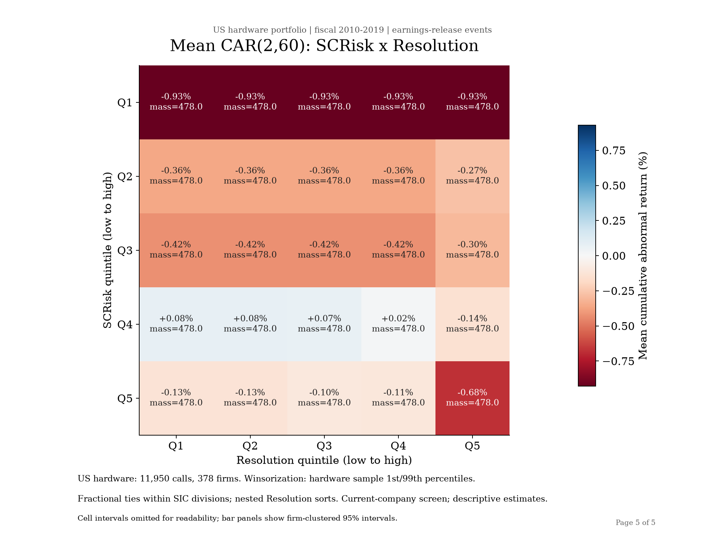

# Hardware portfolio baseline

The canonical roster remains **379 companies**, drawn from the fixed 400-company
screen. The corrected common CAR sample contains **11,950 calls from 378 firms**.
The roster was not selected again using returns. Current listing/headquarters
requirements still introduce survivorship and current-company selection.

The [fiscal-date audit](DATE_AUDIT.md) covers all **12,832 input call records**.
It corrects 54 mappings across 8 firms and excludes 850 unresolved mappings.
Of those exclusions, 45 records identify a different issuer/period and another
74 have unresolved transcript-period conflicts; these 119 also leave the score
scaling population. The remaining **12,713 valid issuer-period transcripts**
set the population SD before CAR gates. The 850 unresolved events are not all
proven erroneous: unsupported or conflicting evidence is held rather than guessed.

Sequential exclusions are 119 transcript identity/period failures, 731 additional
release-mapping holds, 28 incomplete CAR windows, and 4 missing historical SIC
assignments. See [gate counts](gate_counts.csv), [all-call decisions](../../reproduction/hardware_baseline_v1/date_audit.csv.gz),
and [changed mappings](mapping_changes.csv). AMD has no retained
calls; it remains in the roster. The 21 additional screened companies were
already outside that roster.

The input provenance remains 12,690 frozen-corpus reuses, 121 other local reuses,
and 21 previously downloaded Hubbell calls. **This correction used no new Alpha
Vantage requests and no bulk SEC/IR downloads.** Primary cached filings and
targeted web evidence support corrections. Source hashes and access instructions
are in the reproduction package. Raw provider transcripts remain private;
invalid issuer labels do not justify destroying valid underlying transcript text.

## Coverage

| Issuer fiscal year | Mapped calls | Retained calls | Retained firms | Unresolved by provider year |
| --- | ---: | ---: | ---: | ---: |
| 2010 | 357 | 355 | 123 | 357 |
| 2011 | 669 | 663 | 257 | 92 |
| 2012 | 1194 | 1189 | 326 | 54 |
| 2013 | 1311 | 1308 | 341 | 40 |
| 2014 | 1401 | 1397 | 361 | 46 |
| 2015 | 1401 | 1397 | 362 | 50 |
| 2016 | 1362 | 1360 | 353 | 68 |
| 2017 | 1411 | 1411 | 363 | 50 |
| 2018 | 1439 | 1437 | 367 | 46 |
| 2019 | 1437 | 1433 | 368 | 47 |

Provider labels remain stable source identifiers. `issuer_fiscal_period_label`
contains the adjudicated period; unresolved labels are blank, and VFC's 2018
transition is `2018T`. The [annual CSV](coverage_by_year.csv) separates these
populations. Fiscal 2019 releases can occur in 2020. Endpoints do not imply
complete intervening coverage. Weak historical-period evidence particularly
reduces 2010 coverage; this is a material limitation, not evidence of missing calls.

SCRisk is zero for **3,522 / 12,713 valid-score calls (27.7039%)** and
**3,326 / 11,950 retained calls (27.8326%)**. Resolution is zero for
**10,604 valid-score calls (83.4107%)** and **9,962 retained calls (83.3640%)**.
Zeros remain in the fractional sorts.

## Reproduce

With Python 3.14.7:

```sh
PYTHON=/path/to/python3.14 ./scripts/reproduce_hardware.sh
```

The command installs pinned dependencies, runs relevant tests, verifies hashes
and all-call date decisions, recomputes scaling/eligibility/winsorization and
fractional allocation, and checks 13 reference tables. It exports all five PNGs,
the combined PDF and 630 pairwise comparisons. After installation, analysis is
offline and requires no credentials. The portable run starts from derived raw
scores and refitted CARs. [Private-input instructions](../../reproduction/hardware_baseline_v1/INPUT_ACCESS.md)
provide the local-only raw scoring/CAR/SIC reproduction command.

## Methods

[Configuration](../../reproduction/hardware_baseline_v1/config.json) records the
254-term supply-chain, 161-term risk and 55-term Resolution dictionaries and
hashes. Scoring uses the approved exact-term tokenizer/matcher, every qualifying
supply-risk pair at closest-token distance at most 10 (including overlap),
`max_cosine` supply weights, and transcript token length as denominator.
Resolution additionally requires a Resolution occurrence within 10 tokens of
the supply occurrence. Divide each raw score by its hardware population SD
(`ddof=0`, no centering), before CAR exclusion.

The event date is the earnings **release** date. Independently confirmed call
dates remain separate. Day 0 is the first factor-calendar trading day on or
after release; there is no after-hours shift. Carhart OLS uses 200 complete
observations at offsets −209 through −10, an intercept plus market excess,
SMB, HML and momentum, full rank five, and arithmetic adjusted-close returns
minus RF. Both event windows must be complete: 2 days for CAR(0,1) and 59 days
for CAR(2,60). Missing observations never move or compress the windows.

Point-in-time SIC uses the latest filing available by observed fiscal-period
end; no current-SIC backfill. On the common eligible sample, each score and CAR
is winsorized at linear 1st/99th percentiles. Thresholds are recomputed for
hardware and published in [CSV](winsorization_thresholds.csv). Sort within SIC
divisions over the pooled study period, distribute tied groups fractionally,
then sort Resolution conditionally within each SCRisk portfolio using parent
weights. Pool corresponding portfolios across divisions. Each call has total
allocation weight one. Uncertainty is firm-clustered with 95% Student-t
intervals and joint covariance accounting for shared calls. Means are shown in
percent; call-level CARs are decimals. Results are descriptive associations.

The raw-stage driver is [`analysis/hardware_us400`](../../analysis/hardware_us400/).
Shared primary methods are reused unchanged. Two source snapshots preserve the
original scorer/factor-parser versions; a hash and AST equivalence check
verifies the primary definitions used by the active modules. Differences in
newer main concern other scoring modes and CLI validation. The canonical
libraries and original full-universe research prose remain intact.

## Figures and supporting tables

### Mean CAR(0,1) by SCRisk quintile



[Table](01_car_0_1_by_scrisk.csv) · [Joint covariance](01_car_0_1_by_scrisk_covariance.csv)

### Mean CAR(0,1) by Resolution quintile



[Table](02_car_0_1_by_resolution.csv) · [Joint covariance](02_car_0_1_by_resolution_covariance.csv)

### CAR(0,1): SCRisk × Resolution



[Table](03_car_0_1_heatmap.csv) · [Joint covariance](03_car_0_1_heatmap_covariance.csv)

### Mean CAR(2,60) by SCRisk quintile



[Table](04_car_2_60_by_scrisk.csv) · [Joint covariance](04_car_2_60_by_scrisk_covariance.csv)

### CAR(2,60): SCRisk × Resolution



[Table](05_car_2_60_heatmap.csv) · [Joint covariance](05_car_2_60_heatmap_covariance.csv)

[Combined PDF](us_hardware_fractional_charts.pdf) · [630 portfolio comparisons](portfolio_comparisons.csv) · [Zero/tie audit](zero_tie_audit.csv). Comparisons are the existing descriptive results; no new selection or multiple-testing adjustment is introduced.
